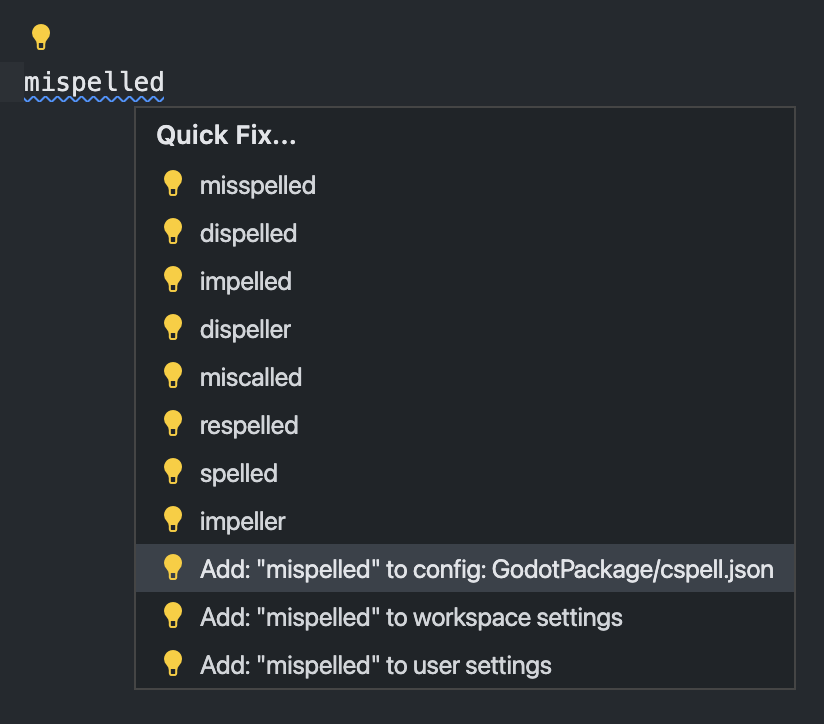
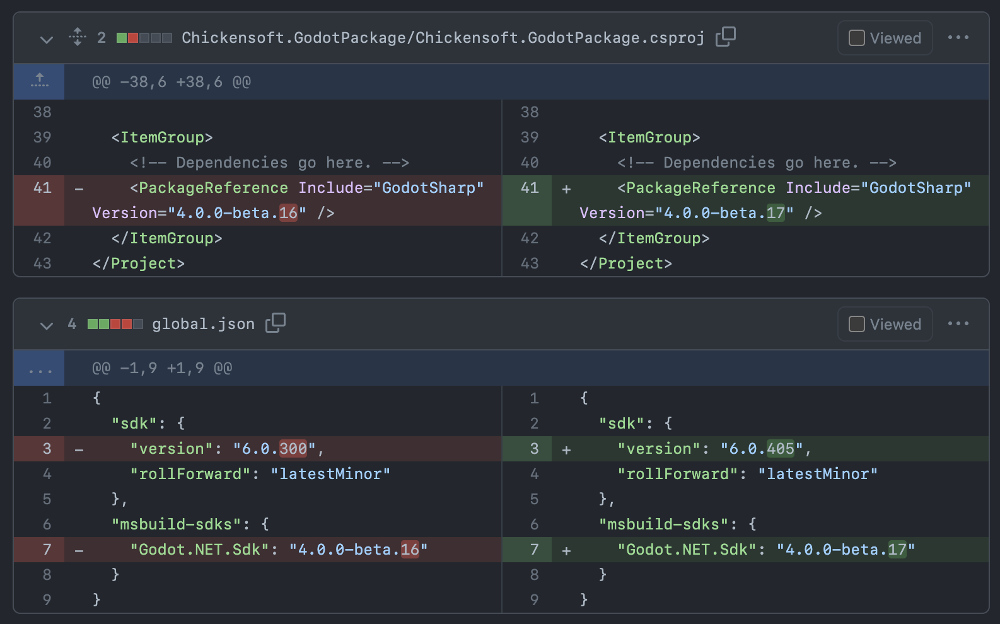

# PdArchEcsCorePersistence

[![Chickensoft Badge][chickensoft-badge]][chickensoft-website] [![Discord][discord-badge]][discord] [![Read the docs][read-the-docs-badge]][docs] ![line coverage][line-coverage] ![branch coverage][branch-coverage]

A .NET template for quickly creating a C# nuget package for use with Godot 4.

---

<p align="center">

</p>

## 🥚 Getting Started

This template allows you to easily create a nuget package for use in Godot 4 C# projects. Microsoft's `dotnet` tool allows you to easily create, install, and use templates.

```sh
# Install this template
dotnet new --install PdArchEcsCorePersistence

# Generate a new project based on this template
dotnet new chickenpackage --name "MyPackageName" --param:author "My Name"

# Use Godot to generate files needed to compile the package's test project.
cd MyPackageName/MyPackageName.Tests/
$GODOT --headless --build-solutions --quit
dotnet build
```

## 💁 Getting Help

*Is this template broken? Encountering obscure C# build problems?* We'll be happy to help you in the [Chickensoft Discord server][discord].

## 🏝 Environment Setup

For the provided debug configurations and test coverage to work correctly, you must setup your development environment correctly. The [Chickensoft Setup Docs][setup-docs] describe how to setup your Godot and C# development environment, following Chickensoft's best practices.

### VSCode Settings

This template includes some Visual Studio Code settings in `.vscode/settings.json`. The settings facilitate terminal environments on Windows (Git Bash, PowerShell, Command Prompt) and macOS (zsh), as well as fixing some syntax colorization issues that Omnisharp suffers from. You'll also find settings that enable editor config support in Omnisharp and the .NET Roslyn analyzers for a more enjoyable coding experience.

> Please double-check that the provided VSCode settings don't conflict with your existing settings.

## .NET Versioning

The included [`global.json`](./global.json) specifies the version of the .NET SDK that the included projects should use. It also specifies the `Godot.NET.Sdk` version that the included test project should use (since tests run inside an actual Godot game so you can use the full Godot API to verify your package is working as intended).

## 🐞 Debugging

You can debug the included test project for your package in `PdArchEcsCorePersistence.Tests/` by opening the root of this repository in VSCode and selecting one of the launch configurations: `Debug Tests` or `Debug Current Test`.

> For the launch profile `Debug Current Test` to work, your test file must share the same name as the test class inside of it. For example, a test class named `PackageTest` must reside in a test file named `PackageTest.cs`.

The launch profiles will trigger a build (without restoring packages) and then instruct .NET to run Godot 4 (while communicating with VSCode for interactive debugging).

> **Important:** You must setup a `GODOT` environment variable for the launch configurations above. If you're using [GodotEnv] to install and manage Godot versions, you're already setup! For more info, see the [Chickensoft Setup Docs][setup-docs].

## 👷 Testing

By default, a test project in `PdArchEcsCorePersistence.Tests/` is created for you to write tests for your package. [GoDotTest] is already included and setup, allowing you to focus on development and testing.

[GoDotTest] is an easy-to-use testing framework for Godot and C# that allows you to run tests from the command line, collect code coverage, and debug tests in VSCode.

The project is configured to allow tests to be easily run and debugged from VSCode or executed via CI/CD workflows, without having to include the test files or test dependencies in the final release build.

The `Main.tscn` and `Main.cs` scene and script file are the entry point of your game. In general, you probably won't need to modify these unless you're doing something highly custom. If the game isn't running in test mode (or it's a release build), it will just immediately change the scene to `game/Game.tscn`. In general, prefer editing `game/Game.tscn` over `Main.tscn`.
If you run Godot with the `--run-tests` command line argument, the game will run the tests instead of switching to the game scene located at `game/Game.tscn`. The provided debug configurations in `.vscode/launch.json` allow you to easily debug tests (or just the currently open test, provided its filename matches its class name).

Please see `test/ExampleTest.cs` and the [GoDotTest] readme for more examples.

## 🚦 Test Coverage

Code coverage requires a few `dotnet` global tools to be installed first. You should install these tools from the root of the project directory.

```sh
dotnet tool install --global coverlet.console
dotnet tool update --global coverlet.console
dotnet tool install --global dotnet-reportgenerator-globaltool
dotnet tool update --global dotnet-reportgenerator-globaltool
```

> Running `dotnet tool update` for the global tool is often necessary on Apple Silicon computers to ensure the tools are installed correctly.

You can collect code coverage and generate coverage badges by running the bash script in `test/coverage.sh` (on Windows, you can use the Git Bash shell that comes with git).

```sh
# Must give coverage script permission to run the first time it is used.
chmod +x test/.coverage.sh

# Run code coverage:
cd PdArchEcsCorePersistence.Tests
./coverage.sh
```

You can also run test coverage through VSCode by opening the command palette and selecting `Tasks: Run Task` and then choosing `coverage`.

## 🏭 CI/CD

This package includes various GitHub Actions workflows to make developing and deploying your package easier.

### 🚥 Tests

Tests run on every push or pull request to the repository. You can configure which platforms you want to run tests on in [`.github/workflows/tests.yaml`](.github/workflows/tests.yaml).

By default, tests run each platform (macOS, Windows, and Linux) using the latest beta version of Godot 4.

Tests are executed by running the Godot test project in `PdArchEcsCorePersistence.Tests` from the command line and passing in the relevant arguments to Godot so that [GoDotTest] can discover and run tests.

### 🧑‍🏫 Spellcheck

A spell check runs on every push or pull request to the repository. Spellcheck settings can be configured in [`.github/workflows/spellcheck.yaml`](.github/workflows/spellcheck.yaml)

The [Code Spell Checker][cspell] plugin for VSCode is recommended to help you catch typos before you commit them. If you need add a word to the dictionary, you can add it to the `cspell.json` file.

You can also words to the local `cspell.json` file from VSCode by hovering over a misspelled word and selecting `Quick Fix...` and then `Add "{word}" to config: GodotPackage/cspell.json`.



### 📦 Release

The included workflow in [`.github/workflows/release.yaml`](.github/workflows/publish.yaml) can be manually dispatched when you're ready to make a new release. Once you specify `major`, `minor`, or `patch` for the version bump strategy, the workflow will build your package with the updated version and release it on both GitHub and nuget.

The accompanying [`.github/workflows/auto_release.yaml`](.github/workflows/auto_release.yaml) will trigger the publish workflow if it detects a new commit in main that is a routine dependency update from renovatebot. Since Renovatebot is configured to auto-merge dependency updates, your package will automatically be published to Nuget when a new version of Godot.NET.Sdk is released or other packages you depend on are updated. If this behavior is undesired, remove the `"automerge": true` property from [`renovate.json`](./renovate.json).

> To publish to nuget, you need to configure a repository or organization secret within GitHub named `NUGET_API_KEY` that contains your Nuget API key. Make sure you setup `NUGET_API_KEY` as a **secret** (rather than an environment variable) to keep it safe!

### 🏚 Renovatebot

This repository includes a [`renovate.json`](./renovate.json) configuration for use with [Renovatebot]. Renovatebot can automatically open and merge pull requests to help you keep your dependencies up to date when it detects new dependency versions have been released.



> Unlike Dependabot, Renovatebot is able to combine all dependency updates into a single pull request — a must-have for Godot C# repositories where each sub-project needs the same Godot.NET.Sdk versions. If dependency version bumps were split across multiple repositories, the builds would fail in CI.

The easiest way to add Renovatebot to your repository is to [install it from the GitHub Marketplace][get-renovatebot]. Note that you have to grant it access to each organization and repository you want it to monitor.

The included `renovate.json` includes a few configuration options to limit how often Renovatebot can open pull requests as well as regex's to filter out some poorly versioned dependencies to prevent invalid dependency version updates.

If your project is setup to require approvals before pull requests can be merged *and* you wish to take advantage of Renovatebot's auto-merge feature, you can install the [Renovate Approve][renovate-approve] bot to automatically approve the Renovate dependency PR's. If you need two approvals, you can install the identical [Renovate Approve 2][renovate-approve-2] bot. See [this][about-renovate-approvals] for more information.

---

🐣 Package generated from a 🐤 Chickensoft Template — <https://chickensoft.games>

[chickensoft-badge]: https://raw.githubusercontent.com/chickensoft-games/chickensoft_site/main/static/img/badges/chickensoft_badge.svg
[chickensoft-website]: https://chickensoft.games
[discord-badge]: https://raw.githubusercontent.com/chickensoft-games/chickensoft_site/main/static/img/badges/discord_badge.svg
[discord]: https://discord.gg/gSjaPgMmYW
[read-the-docs-badge]: https://raw.githubusercontent.com/chickensoft-games/chickensoft_site/main/static/img/badges/read_the_docs_badge.svg
[docs]: https://chickensoft.games/docsickensoft%20Discord-%237289DA.svg?style=flat&logo=discord&logoColor=white
[line-coverage]: PdArchEcsCorePersistence.Tests/badges/line_coverage.svg
[branch-coverage]: PdArchEcsCorePersistence.Tests/badges/branch_coverage.svg

[GoDotTest]: https://github.com/chickensoft-games/go_dot_test
[setup-docs]: https://chickensoft.games/docs/setup
[cspell]: https://marketplace.visualstudio.com/items?itemName=streetsidesoftware.code-spell-checker
[Renovatebot]: https://www.mend.io/free-developer-tools/renovate/
[get-renovatebot]: https://github.com/apps/renovate
[renovate-approve]: https://github.com/apps/renovate-approve
[renovate-approve-2]: https://github.com/apps/renovate-approve-2
[about-renovate-approvals]: https://stackoverflow.com/a/66575885
[GodotEnv]: https://github.com/chickensoft-games/GodotEnv
